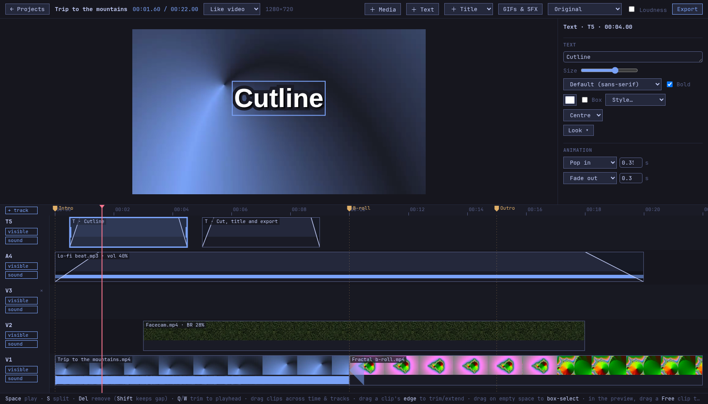
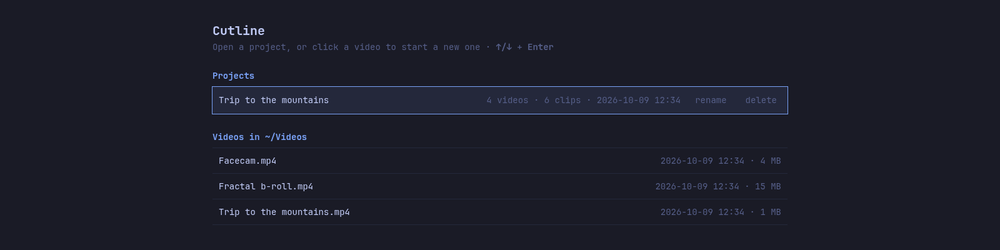
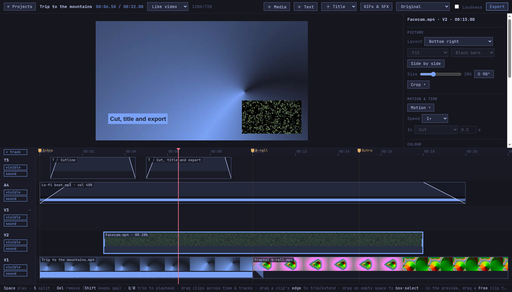

# Cutline

**A fast, keyboard-friendly multi-track video editor for Linux: cut, trim and stack clips, then export a frame-exact MP4 with ffmpeg.**

<!-- Screenshots: add the images to docs/screenshots/ and uncomment.



-->
> 📸 _Screenshots coming soon: editor · start screen · picture-in-picture._

Cutline is a small local app: a Python server (standard library only) drives
ffmpeg, and the editor runs in a Chromium app window. Your videos are never
modified. Projects are small JSON files, and exports are rendered from the
original files.

## Features

- **Projects**: start from any video, reopen, rename or delete them from the start screen. Everything autosaves.
- **Multiple tracks**: stack clips; higher tracks draw on top. Hide or mute any track.
- **Editing**: split at the playhead, trim to the playhead, drag edges to trim or extend, ripple delete (or keep the gap), undo/redo.
- **Selection**: click, Shift-click, box-select by dragging over empty space, or select a **gap** and delete it to close it.
- **Per-clip volume**, 0–200 %, with the waveform following along.
- **Picture-in-picture**: put any clip full screen or in a corner, at 10–70 % size.
- **Smooth preview**: light 540p proxies are made in the background, on the GPU through VA-API when available, falling back to the CPU.
- **HDR → SDR**: iPhone HLG / Dolby Vision footage is tone-mapped (libplacebo on the GPU, zscale on the CPU as a fallback), so it doesn't look washed out or red.
- **Frame-exact export**: every clip is snapped to whole frames, so audio and video stay in sync over many cuts. Export at original size or 1080p.
- **Native on Omarchy**: follows the current Omarchy theme colours and font live. Elsewhere it uses a Tokyo Night palette.

## Install

### Arch Linux (AUR)

```sh
yay -S cutline        # or: paru -S cutline
```

### From a git clone (any Linux)

```sh
git clone https://github.com/antoniowav/cutline.git
cd cutline
./install             # installs into ~/.local
```

`./install` copies the app to `~/.local/lib/cutline`, links `~/.local/bin/cutline`,
and adds a desktop entry and icon. Use `./install --link` to link straight to
the checkout instead (handy while hacking on it), or `PREFIX=/some/where ./install`
to install elsewhere. Update with `git pull && ./install`.

## Usage

```sh
cutline                 # start screen: recent projects + videos in your Videos folder
cutline clip.mp4        # new project with this video
cutline --version
```

You can also right-click a video in your file manager → *Open With → Cutline*.
**Export** writes `<project>-edit.mp4` next to the project's first video
(`-edit-1080p.mp4` for the 1080p option, with `-2`, `-3`… added instead of overwriting),
then opens that folder.

The window can be closed at any time: everything is saved, and the background
server quits a few seconds later. If an export is still running, it finishes first.

### Keyboard shortcuts

| Key | Action |
| --- | --- |
| <kbd>Space</kbd> | Play / pause |
| <kbd>S</kbd> | Split at the playhead (selected clips, or every visible clip under it) |
| <kbd>Delete</kbd> / <kbd>Backspace</kbd> | Remove the selected clips and close the space (ripple) |
| <kbd>Shift</kbd>+<kbd>Delete</kbd> | Remove the selected clips and leave a gap |
| <kbd>Delete</kbd> on a selected gap | Close the gap |
| <kbd>Q</kbd> / <kbd>W</kbd> | Trim the clip under the playhead: start / end to the playhead |
| <kbd>A</kbd> | Add a video (at the end of V1, or on a track above at the playhead) |
| <kbd>←</kbd> / <kbd>→</kbd> | One frame back / forward (<kbd>Shift</kbd>: 1 s, <kbd>Alt</kbd>: 5 s) |
| <kbd>Home</kbd> / <kbd>End</kbd> | Jump to start / end |
| <kbd>+</kbd> / <kbd>-</kbd> / <kbd>0</kbd> | Zoom in / zoom out / fit the whole timeline |
| <kbd>Ctrl</kbd>+<kbd>Z</kbd> | Undo |
| <kbd>Ctrl</kbd>+<kbd>Shift</kbd>+<kbd>Z</kbd> or <kbd>Ctrl</kbd>+<kbd>Y</kbd> | Redo |
| <kbd>Ctrl</kbd>+<kbd>A</kbd> | Select all clips |
| <kbd>Ctrl</kbd>+<kbd>S</kbd> | Save now (it also autosaves) |
| <kbd>Esc</kbd> | Clear the selection |

Start screen and *Add video* list: <kbd>↑</kbd>/<kbd>↓</kbd> to move, <kbd>Enter</kbd> to open, <kbd>Esc</kbd> to close the list.

### Mouse and trackpad

- **Click** a clip to select it, **Shift-click** to add or remove it from the selection.
- **Drag** clips across time and between tracks; they snap to clip edges, the playhead and 0.
- **Drag a clip's edge** to trim or extend it.
- **Drag over empty space** to box-select; **click empty space** in a track to select a gap.
- **Click or drag in the ruler** to scrub.
- **Scroll / swipe** to move along the timeline; **Ctrl+scroll** or **pinch** to zoom;
  scroll over the track names (or **Alt+scroll**) to scroll through tracks.
- Track header: **visible / hidden**, **sound / muted**, **×** removes an empty track, **+ track** adds one.
- Inspector: **Layout** (full screen or a corner), **Size** for corner clips, **Volume** (double-click to reset to 100 %).

## Requirements

| | |
| --- | --- |
| **Python** ≥ 3.11 | standard library only |
| **ffmpeg** | with `libplacebo` for GPU HDR tone mapping (Arch's ffmpeg has it); `zscale` is used otherwise |
| **A Chromium-based browser** | Chromium, Google Chrome, Brave, Vivaldi, Edge… for the app window. Without one, Cutline opens in your default browser. |
| _optional_ VA-API driver | GPU-made preview proxies (`libva-mesa-driver` / `intel-media-driver`); the CPU is used otherwise |
| _optional_ Vulkan driver | needed by libplacebo; without it HDR is tone-mapped on the CPU |
| _optional_ `xdg-user-dirs`, `xdg-utils` | find your Videos folder; open the export folder; pick your default browser |
| _optional_ Omarchy | live theme colours (`~/.local/state/omarchy/current/theme/colors.toml`) and font (`omarchy font current`) |

### Settings (environment variables)

| Variable | Default | |
| --- | --- | --- |
| `CUTLINE_BROWSER` | your default browser if it's Chromium-based, else the first one found | Browser command for the app window, e.g. `brave` or `flatpak run com.brave.Browser` |
| `CUTLINE_VIDEOS` | XDG Videos folder (`xdg-user-dir VIDEOS`), else `~/Videos` | Folder listed on the start screen (searched 4 levels deep) |
| `CUTLINE_NO_BROWSER` | unset | Only start the server and print its URL |

## Data locations

| What | Where |
| --- | --- |
| Projects (JSON) | `$XDG_DATA_HOME/cutline/projects`, by default `~/.local/share/cutline/projects` |
| Preview proxies, thumbnails, waveforms | `$XDG_CACHE_HOME/cutline`, by default `~/.cache/cutline`. Safe to delete; it is rebuilt when needed. |
| Exports | Next to the project's first video |

Cutline only listens on `127.0.0.1` and only answers its own window.

## Uninstall

- AUR / pacman: `sudo pacman -R cutline`
- Git-clone install: `./uninstall` from the checkout

Both leave your projects and cache in place. To remove them too:

```sh
rm -rf ~/.local/share/cutline ~/.cache/cutline
```

## License

[MIT](LICENSE) © Antonio Piattelli
